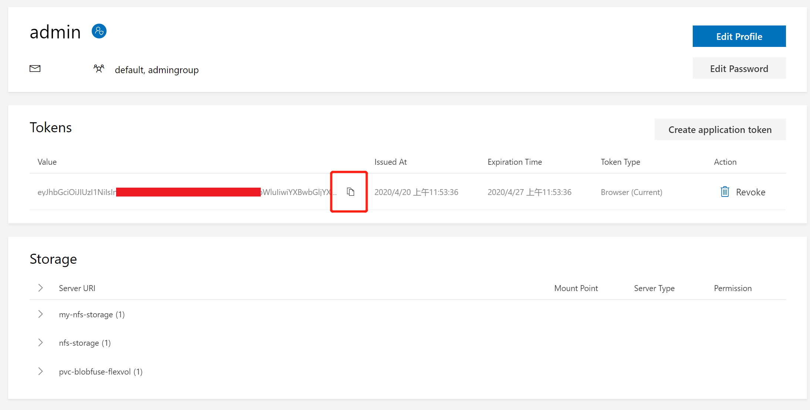
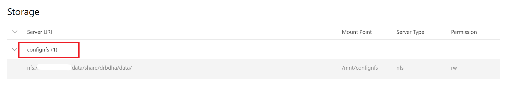
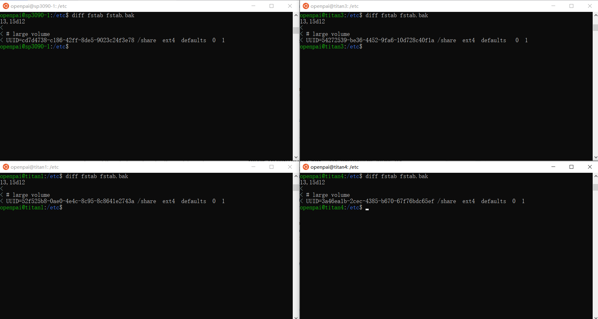

# OpenPAI 集群搭建与维护


# 1. 准备集群
需要对`dev box机器` `master机器` `worker机器`进行软硬件准备

## 1.1 dev box机器
`dev box`机器在安装、维护和卸载期间，通过SSH控制master机器和worker机器。

- 硬件要求
  - 它可以与所有其他机器（master和worker机器）通信。(同一局域网)
  - 它是独立于master机器和worker机器之外的一台机器。
  - 它可以访问Internet。尤其是可以访问Docker Hub。部署过程会从Docker Hub拉取Docker镜像。

- 软件要求
  - Ubuntu 16.04 (18.04、20.04应该可用，但没有经过完整测试)
  - SSH服务已开启, `sudo apt install openssh-server`
  - 可以免密登录所有master和worker机器。
    `scp devbox@<ip-of-devbox>:/home/devbox/id_rsa.pub; cat id_rsa.pub >> ~/.ssh/authorized_keys`。
    [如何免密ssh登录](https://blog.csdn.net/wenyun_kang/article/details/77413714)
  - Docker已被正确安装。[本文所用安装命令](#docker_install) | [官方安装教程](https://docs.docker.com/engine/install/ubuntu/) | [非官方安装教程](https://www.cnblogs.com/walker-lin/p/11214127.html)

## 1.2 master机器
master机器用于运行核心Kubernetes组件和核心OpenPAI服务。
- 硬件要求
  - 至少40GB内存。 
  - 必须有固定的局域网 IP 地址（LAN IP address），且可以和其他所有机器通信。
  - 可以访问Internet。尤其是可以访问Docker Hub。部署过程会从Docker Hub拉取Docker镜像。
    
- 软件要求
  - Ubuntu 16.04 (18.04、20.04应该可用，但没有经过完整测试)
  - SSH服务已开启。(在`/etc/ssh/sshd_config`下确认22端口, 并`sudo ufw allow ssh`)
  - 和所有worker机器有同样的SSH用户名和密码([创建用户](https://blog.csdn.net/taolusi/article/details/81304057 ))，
    且该SSH用户有sudo权限，如果没有权限，使用`adduser <username> sudo`来[授予权限](https://www.cnblogs.com/yadongliang/p/8659950.html )。
  - Docker已被正确安装。[本文所用安装命令](#docker_install) | [官方安装教程](https://docs.docker.com/engine/install/ubuntu/) | [非官方安装教程](https://www.cnblogs.com/walker-lin/p/11214127.html)
  - NTP已被成功开启。 可以用命令`apt install ntp`来检查。
  - 它是OpenPAI的专用服务器。OpenPAI管理它的所有资源（如CPU、内存、GPU等）。如果有其他工作负载，则可能由于资源不足而导致未知问题。

## 1.3 worker机器
worker机器会被用来执行任务，可以在安装期间指定一台或多台worker机器，
同一集群内可以有配置不同的多种worker机器。 下面给出Nvidia Worker的要求。

- 硬件要求
  - 至少16GB内存。
  - 必须有固定的局域网 IP 地址（LAN IP address），且可以和其他所有机器通信。
  - 可以访问Internet。尤其是可以访问Docker Hub。部署过程会从Docker Hub拉取Docker镜像。
    
- 软件要求
  - Ubuntu 16.04 (18.04、20.04应该可用，但没有经过完整测试)
  - SSH服务已开启。 
  - 所有master和worker机器有同样的SSH用户名和密码，且该SSH用户有sudo权限。
  - Docker已被正确安装。
  - 它是OpenPAI的专用服务器。OpenPAI管理它的所有资源（如CPU、内存、GPU等）。如果有其他工作负载，则可能由于资源不足而导致未知问题
  - GPU驱动已被正确安装。 可以用`nvidia-smi`来检查。目前测试使用的驱动版本是`470.57.02`
  - nvidia-container-runtime已被正确安装，并且被设置为Docker的默认runtime。
     - 使用命令`sudo docker run --rm nvidia/cuda:10.0-base nvidia-smi`来检查这一项。如果该命令成功打出当前可用的显卡个数，就说明设置是没问题的。
     - 如果尚未安装nvidia-container-runtime，参考如下操作
  
**安装[nvidia-container-runtime](https://github.com/NVIDIA/nvidia-container-runtime#installation)**

- (Pre-requisite)<span id="docker_install">安装Docker

```
# 安装Docker
sudo apt-get update
sudo apt-get install \
  apt-transport-https \
  ca-certificates \
  curl \
  gnupg \
  lsb-release

curl -fsSL https://download.docker.com/linux/ubuntu/gpg | sudo gpg --dearmor -o /usr/share/keyrings/docker-archive-keyring.gpg
echo \
  "deb [arch=amd64 signed-by=/usr/share/keyrings/docker-archive-keyring.gpg] https://download.docker.com/linux/ubuntu \
  $(lsb_release -cs) stable" | sudo tee /etc/apt/sources.list.d/docker.list > /dev/null
sudo apt-get update

sudo apt-get install docker-ce docker-ce-cli containerd.io  # 安装Docker
sudo docker run hello-world  # 验证安装
```

- 安装nvidia-container-runtime
```
# 配置apt库
sudo echo # 为当前shell获得权限
curl -s -L https://nvidia.github.io/nvidia-container-runtime/gpgkey | \
  sudo apt-key add -
distribution=$(. /etc/os-release;echo $ID$VERSION_ID)
curl -s -L https://nvidia.github.io/nvidia-container-runtime/$distribution/nvidia-container-runtime.list | \
  sudo tee /etc/apt/sources.list.d/nvidia-container-runtime.list
sudo apt-get update

# 安装
sudo apt-get install nvidia-container-runtime

# 验证
sudo docker run --rm nvidia/cuda:10.0-base nvidia-smi
```
- 如果验证未成功，则需要进行如下配置
```
# (如果验证未成功)配置nvidia-container-runtime设置为默认runtime
sudo cp /etc/docker/daemon.json /etc/docker/daemon.json.backup  # 备份原始Docker配置
echo "{
  \"default-runtime\": \"nvidia\",
  \"runtimes\": {
      \"nvidia\": {
          \"path\": \"/usr/bin/nvidia-container-runtime\",
          \"runtimeArgs\": []
      }
  }
}" | sudo tee -a /etc/docker/daemon.json

sudo systemctl restart docker

# 再次验证
sudo docker run --rm nvidia/cuda:10.0-base nvidia-smi
```
将nvidia-container-runtime设置为默认runtime, 即在worker机器上[修改/etc/docker/daemon.json](https://openpai.readthedocs.io/zh_CN/latest/manual/cluster-admin/installation-faqs-and-troubleshooting.html#how-to-install-nvidia-container-runtime) ，
 ！！修改后需要重启docker`sudo systemctl restart docker`使其生效
    

# 2. 安装OpenPAI
<span id="openpai-install">具体的官方文档 [link](https://openpai.readthedocs.io/zh_CN/latest/manual/cluster-admin/installation-guide.html#installation-requirements)

## [创建设置文件](https://openpai.readthedocs.io/zh_CN/latest/manual/cluster-admin/installation-guide.html#_3)
在`dev box机器`上，使用下面的命令来克隆OpenPAI的repo：
```
git clone https://github.com/microsoft/pai.git
cd pai
git checkout v1.7.0
```

接下来，需要编辑`<pai-code-dir>/contrib/kubespray/config`目录下的`layout.yaml`和`config.yaml`文件。
这两个文件分别指定了集群的机器组成和自定义设置。
```
# The following files are modified
pai/contrib/kubespray/config/config.yaml
pai/contrib/kubespray/config/layout.yaml
pai/contrib/kubespray/quick-start-kubespray.sh
```
因为墙的问题，需要[额外配置](https://openpai.readthedocs.io/zh_CN/latest/manual/cluster-admin/configuration-for-china.html)
其中的一些镜像源不定期失效，建议最好使用[离线保存](#jump)出来的镜像

link to example files: [config.yaml](cluster-configuration/config.yaml), [layout.yaml](cluster-configuration/layout.yaml), [quick-start-kubespray.sh](material/example/quick-start-kubespray.sh)


## 安装Kubernetes
基本参考[**官方教程**]((https://openpai.readthedocs.io/zh_CN/latest/manual/cluster-admin/installation-guide.html#kubernetes))

由于网络问题:
- 可以离线安装, 只是需要进行一些 [**额外操作**](#jump)
- 如果不采取离线安装，则需要妥善 [**配置镜像源**](https://openpai.readthedocs.io/zh_CN/latest/manual/cluster-admin/configuration-for-china.html)
```
# 实际成功过的镜像源
gcr_image_repo: "registry.cn-hangzhou.aliyuncs.com"
kube_image_repo: "registry.cn-hangzhou.aliyuncs.com/google_containers"

openpai_kubespray_extra_var:
 pod_infra_image_repo: "mirrorgooglecontainers/pause-{{ image_arch }}"
 dnsautoscaler_image_repo: "mirrorgooglecontainers/cluster-proportional-autoscaler-{{ image_arch }}"
 tiller_image_repo: "registry.cn-hangzhou.aliyuncs.com/kubernetes-helm/tiller"
 registry_proxy_image_repo: "mirrorgooglecontainers/kube-registry-proxy"
 metrics_server_image_repo: "mirrorgooglecontainers/metrics-server-amd64"
 addon_resizer_image_repo: "mirrorgooglecontainers/addon-resizer"
 dashboard_image_repo: "mirrorgooglecontainers/kubernetes-dashboard-{{ image_arch }}"
 
# 中间有些环节会从github下载一些东西，也会被墙，只能看运气
```

<span id="k8s-install">完成准备后我们使用kubespray安装Kubernetes:
```
# 目录`<pai-code-dir>/contrib/kubespray`中包含了Kubernetes和OpenPAI服务的代码。
cd <pai-code-dir>/contrib/kubespray

# install Kubernetes with kubespray
/bin/bash quick-start-kubespray.sh -v
```

如果在安装过程中出现任何问题，请再次检查上述环境要求。
官方也提供了一个脚本，帮助进行检查(虽然似乎没啥大用)：
``` 
/bin/bash requirement.sh -l config/layout.yaml -c config/config.yaml
```
解决问题后，请重新运行`/bin/bash quick-start-kubespray.sh`
本文提供了一些遇到的[问题和解决方案](#problem-solving), 也建议在官方github issue中寻找解决方案

如果安装成功，会打印出下面的信息：
```
You can run the following commands to setup kubectl on you local host:
ansible-playbook -i ${HOME}/pai-deploy/kubespray/inventory/pai/hosts.yml set-kubectl.yml --ask-become-pass
```
在默认情况下，上述命令既不会在`dev box机器`上配置默认的kubeconfig，也不会安装kubectl客户端，
只会把Kubernetes的config文件放在`~/pai-deploy/kube/config`，
可以在任何Kubernetes客户端上使用这个config，来连接到Kubernetes集群，例如[将管理权限转移到一个dev box容器中](#dev-box-transfer)。
将该容器打包为镜像后，可以[部署在其他机器上](#dev-box-transfer2)，从而转移对集群的管理权限

(Optional 不推荐) 如果希望在本地对集群进行管理(不依赖于`dev box 容器`)，则可以根据安装成功的提示信息，运行
```
# (Optional) install kubectl
ansible-playbook -i \
    ${HOME}/pai-deploy/kubespray/inventory/pai/hosts.yml \
    <pai-code-dir>/contrib/kubespray/set-kubectl.yml \ 
    --ask-become-pass  # as become password (sudo password is okey)
```
该命令会把Kubernetes的config拷贝到~/.kube/config，并安装kubectl。
成功运行后，就可以直接在`dev box机器`上使用kubectl来控制集群了。

## [安装OpenPAI服务](https://openpai.readthedocs.io/zh_CN/latest/manual/cluster-admin/installation-guide.html#openpai)
Kubernetes安装成功后，请使用下面的代码来安装OpenPAI服务：
```
/bin/bash quick-start-service.sh
```
如果一切顺利，将会看到下面的信息：
```
Kubernetes cluster config :     ~/pai-deploy/kube/config
OpenPAI cluster config    :     ~/pai-deploy/cluster-cfg
OpenPAI cluster ID        :     pai
Default username          :     admin
Default password          :     admin-password

You can go to http://<your-master-ip>, then use the default username and password to log in.
```

正如这个提示所说的，我们可以用 admin 和 admin-password 来登录Webportal，并提交一个任务来验证安装。
另外，我们已在目录~/pai-deploy/cluster-cfg下生成了OpenPAI的配置文件，如果之后需要自定义集群的话
这些配置文件有可能会被用到。


# 3. PAI服务管理和 Paictl
**本步骤的目的是为Dev Box管理集群提供工具**
PAI服务是指运行在Kubernetes上的PAI系统创建的守护程序集，部署或状态集。
Paictl是OpenPAI提供的管理PAI服务的CLI工具(命令行工具)，可帮助我们管理集群配置和PAI服务。

可以在`dev box机器`上的文件夹`~/pai-deploy/cluster-cfg`中找到两个文件：`layout.yaml`和`services-configuration.yaml`。
这两个文件是默认的服务配置。

官方推荐通过`dev box Docker镜像`来使用paictl以避免与环境相关的问题。
换言之，`paictl`的所有操作都依托于`dev box容器`，
`dev box容器`也可以被看作是管理整个集群的一个终端。

首先，找一台`dev box机器`(！！**可以与安装集群时用的那台不一样**，只要把`~/pai-deploy/kube/config`备份过来即可，
当然保险起见可以把`/pai`和`/pai-deploy`全部备份过来，需要注意的是备份过程中有些文件的权限较高，需要`sudo cp`)，
然后在`dev box机器`的终端中通过以下方式启动`dev box容器`。

```
sudo docker run -itd \
        -e COLUMNS=$COLUMNS -e LINES=$LINES -e TERM=$TERM \
        -v /var/run/docker.sock:/var/run/docker.sock \
        --pid=host \
        --privileged=true \
        --net=host \
        --name=dev-box \
        openpai/dev-box:<openpai-version-tag>  # 应将`<openpai-version-tag>`替换为当前实际安装的OpenPAI相符的版本，例如`v1.7.0`
```

要使用paictl，请通过以下方式进入`dev box容器`：
```
sudo docker exec -it dev-box bash
```

<span id="dev-box-transfer">然后，需要手动将kubeconfig设置到`dev box容器`中。
在安装时，`kubeconfig`已经被放在了`dev box机器`上的`~/pai-deploy/kube/config`路径，
现在需要将这个文件的内容拷贝到容器中的~/.kube/config里面：

```
# 在 dev box 容器中
mkdir -p ~/.kube
# 把 dev box机器上的`~/pai-deploy/kube/config`中的内容拷贝到这里的 `~/.kube/config`
vim ~/.kube/config
```

转到文件夹/pai，尝试检查集群ID：
```
cd /pai
./paictl.py config get-id  # 如果一切正常，那么该命令会显示集群ID
```
上述命令会显示集群ID，
这个ID在其他`paictl`命令提示`Please input the cluster-id which you wanna operate:`时会用到

以下是paictl的一些基本用法示例：
```
# 获取集群ID
./paictl.py config get-id

# 将集群中正在使用的设置拉取到一个文件夹中
# 集群设置文件夹包含三个文件: config.yaml, layout.yaml 和 services-configuration.yaml
# 其中 config.yaml 在 v1.7.0 版本之前存储于 ~/pai-deploy/cluster-cfg/config.yaml
# 如果 /cluster-configuration中已经有这三个文件了，老的文件将会被覆盖
./paictl.py config pull -o /cluster-configuration

# 将文件夹中的配置上传到集群内
# 集群设置文件夹应该包含三个文件: config.yaml, layout.yaml 和 services-configuration.yaml
# 其中 config.yaml 在 v1.7.0 版本之前存储于 ~/pai-deploy/cluster-cfg/config.yaml
# 只有被成功上传的配置才会被应用
./paictl.py config push -p /cluster-configuration -m service

# 停止所有PAI服务
./paictl.py service stop

# 启动所有PAI服务
./paictl.py service start

# 重启
./paictl.py service stop  
./paictl.py service start

# 停止某些PAI服务
./paictl.py service stop -n <service-name-1> <service-name-2>

# 启动某些PAI服务
./paictl.py service start -n <service-name-1> <service-name-2>
```
如果要更改某些服务的配置，请按照`service stop`、`config push`、`service start`的步骤进行。

例如，如果要自定义Webportal，则应修改services-configuration.yaml中的webportal部分。 然后使用以下命令来上传配置并重新启动Webportal：
```
./paictl.py service stop -n webportal
./paictl.py config push -p /cluster-configuration -m service
./paictl.py service start -n webportal
```
另一个示例是重新启动整个集群：
```
# restart cluster
./paictl.py service stop
./paictl.py service start
```
可以使用`exit`离开`dev-box容器`,
或使用如下命令重新进入`dev-box容器`：
```
sudo docker exec -it dev-box bash
```
删除`dev-box容器`：
```
sudo docker stop dev-box
sudo docker rm dev-box
```

- <span id="dev-box-transfer2">将`devbox 容器`部署到其他机器上
首先打包`dev-box 容器`
```
sudo docker ps -a | grep 'openpai/dev-box'  # 得到<devbox-container-id>
sudo docker commit <devbox-container-id> iiaupai/dev-box
sudo docker save -o dev-box.tar iiaupai/dev-box:latest
sudo chmod +r dev-box.tar
```
在目标机器上下载打包好的`devbox 镜像`
```
# 加载镜像
sudo docker load -i dev-box.tar

# 建立启动容器
sudo docker run -itd \
        -e COLUMNS=$COLUMNS -e LINES=$LINES -e TERM=$TERM \
        -v /var/run/docker.sock:/var/run/docker.sock \
        --pid=host \
        --privileged=true \
        --net=host \
        --name=dev-box \
        iiaupai/dev-box:latest

# 开启容器终端
sudo docker exec -it dev-box bash
```
备份的`devbox 镜像`见于[Other Materials](#other-materials)


# 4. 如何设置虚拟集群
`Hivedscheduler`是一个用于深度学习的`Kubernetes Scheduler`。
如果在安装时没有显式声明 `enable_hived_scheduler: false`，那么`Hivedscheduler` 就是开启的

首先启动`dev box容器`
```
sudo docker exec -it dev-box bash
```

在`dev box容器`中，通过以下方式拉取目前集群中的配置：
```
cd /pai
./paictl.py config pull -o /cluster-configuration
```

在`dev box 容器`的`/cluster-configuration`的目录下可以查看集群的各关键配置，
例如`/cluster-configuration/layout.yaml`定义了如下集群：

```
# GPU cluster example
# This is a cluster with one master node and two worker nodes

machine-sku:
  <master-machine-sku>:  # define a machine sku
    # the resource requirements for all the machines of this sku
    # We use the same memory format as Kubernetes, e.g. Gi, Mi
    # Reference: https://kubernetes.io/docs/concepts/configuration/manage-resources-containers/#meaning-of-memory
    mem: 60Gi
    cpu:
      # the number of CPU vcores
      vcore: 24
  <gpu1-machine-sku>:  # define a machine sku with gpu. e.g. k80x4-machine-sku
    computing-device:
      # For `type`, please follow the same format specified in device plugin.
      # For example, `nvidia.com/gpu` is for NVIDIA GPU, `amd.com/gpu` is for AMD GPU,
      # and `enflame.com/dtu` is for Enflame DTU.
      # Reference: https://kubernetes.io/docs/concepts/extend-kubernetes/compute-storage-net/device-plugins/
      type: nvidia.com/gpu
      model: K80
      count: 4
    mem: 220Gi
    cpu:
      vcore: 24
  <gpu2-machine-sku>:  # define another machine sku. e.g. v100x8-machine-sku
    computing-device:
      # For `type`, please follow the same format specified in device plugin.
      # For example, `nvidia.com/gpu` is for NVIDIA GPU, `amd.com/gpu` is for AMD GPU,
      # and `enflame.com/dtu` is for Enflame DTU.
      # Reference: https://kubernetes.io/docs/concepts/extend-kubernetes/compute-storage-net/device-plugins/
      type: nvidia.com/gpu
      model: V100
      count: 8
    mem: 250Gi
    cpu:
      vcore: 48

machine-list:
  # define a master machine
  - hostname: <name-of-master> # name of the machine, **do not** use upper case alphabet letters for hostname
    hostip: 10.0.0.1
    machine-type: <master-machine-sku> # only one master-machine supported
    pai-master: "true"
    # pai-worker: "true"  # wether to set this node as worker node as well
    # pai-storage: "true"  # wether to set this node as a storage node
  
  # define the worker machines
  - hostname: <name-of-worker-1>
    hostip: 10.0.0.2
    machine-type: <gpu1-machine-sku>
    pai-worker: "true"
    # pai-storage: "true"  # wether to set this node as a storage node

  - hostname: <name-of-worker-2>
    hostip: 10.0.0.3
    machine-type: <gpu1-machine-sku>
    pai-worker: "true"
    # pai-storage: "true"  # wether to set this node as a storage node
    
  - hostname: <name-of-worker-3>
    hostip: 10.0.0.4
    machine-type: <gpu2-machine-sku>
    pai-worker: "true"
    # pai-storage: "true"  # wether to set this node as a storage node

```

---

！！**可以将master机器同时作为一台worker**，
master机器设置`pai-worker: "true"`也是可以成功的。例如在`/cluster-configuration/layout.yaml`中：

```
...
machine-list:
  # define a master machine
  - hostname: <name-of-master> # name of the machine, **do not** use upper case alphabet letters for hostname
    hostip: 10.0.0.1
    machine-type: <gpu1-machine-sku> # share the same SKU with the workers **if the master machine has similar resources**
    pai-master: "true"
    pai-storage: "true"  # wether to set this node as a storage node
    pai-worker: "true"  # !! set the master node as worker node as well !!   
...
```
这样就将`<name-of-master>`同时也设置为了一个worker;
- 如果作为master的机器所能提供的资源与各worker相同，那么master也可以使用worker的SKU, e.g. `<gpu1-machine-sku>`。
在后面配置`hivedscheduler`时，将master当作worker分配到虚拟集群中即可;
- 如果作为master的机器与各worker的资源不相同，那么可以定义单独的SKU供master使用，
在`hivedscheduler`分配资源时时也根据master的资源情况单独进行定义。

！！需要注意的是：master可以成为worker，但worker不能成为master，master机器在集群安装时就确定下来了，之后不能更改了，
所以master机器一旦出问题集群可能就废了。另外，在集群最初安装的阶段，quick-start-kubespray.sh是不允许master兼任worker的，
集群安装成功以后修改配置，似乎是可以的。

---
关于`hivedscheduler`的配置，请参考(https://github.com/microsoft/hivedscheduler/blob/master/doc/user-manual.md)
在`services-configuration.yaml`中，有一个`hivedscheduler`部分，
在其中将集群中的资源分配给各虚拟集群，例如：
```
# services-configuration.yaml
...
hivedscheduler:
  config: |
    physicalCluster:
      skuTypes:
        <SKUNAME>:
          gpu: 1
          cpu: 5
          memory: 56334Mi  # Average the total source of a Physical Node
      cellTypes:
        <SKUNAME-NODE>:
          childCellType: <SKUNAME>
          childCellNumber: 4
          isNodeLevel: true
        <SKUNAME-NODE-POOL>:
          childCellType: <SKUNAME-NODE>
          childCellNumber: 3
      physicalCells:
      - cellType: <SKUNAME-NODE-POOL>
        cellChildren:  # !! 集群与虚拟集群的映射
        - cellAddress: <name-of-worker-1>
        - cellAddress: <name-of-worker-2>
        - cellAddress: <name-of-worker-3>
    virtualClusters:
      default:
        virtualCells:
        - cellType: <SKUNAME-NODE-POOL>.<SKUNAME-NODE>
          cellNumber: 2
      new:
        virtualCells:
        - cellType: <SKUNAME-NODE-POOL>.<SKUNAME-NODE>
          cellNumber: 1

# 注意：<name-of-worker> should be defined in layout.yaml

...
```

如果集群中包含多种节点和SKU, 请参考 [Worker结点含有不同硬件配置](https://openpai.readthedocs.io/zh_CN/latest/manual/cluster-admin/how-to-set-up-virtual-clusters.html#worker)


最后，执行下列指令更新配置并使其生效：
```
cd /pai
./paictl.py service stop -n rest-server hivedscheduler
./paictl.py config push -p /cluster-configuration  -m service
./paictl.py service start -n hivedscheduler rest-server
```

# 5. 如何添加/删除节点

## 5.1 准备工作

- 确认要添加的worker结点符合[安装要求](https://openpai.readthedocs.io/zh_CN/latest/manual/cluster-admin/installation-guide.html##installation-requirements)
- 如果准备添加的结点曾被删除过，可能需要重新加载systemd配置 `sudo systemctl daemon-reload`

## 5.2 更改集群设置

首先启动`dev box容器`
```
sudo docker exec -it dev-box bash
```

在`dev box容器`中，通过以下方式拉取目前集群中的配置：
```
cd /pai
./paictl.py config pull -o /cluster-configuration
```
首先检查`/cluster-configuration/config.yaml`中的设置是否能确保连接到集群中的所有机器。
如果使用SSH密钥对连接到集群，请将`dev box机器`上的`~/.ssh`文件夹挂载(或复制)到`dev box容器`的`/root/.ssh`

！！`dev box容器`中似乎缺少ansible工具，```apt install ansible -y```

下面，修改`/cluster-configuration/layout.yaml`, 向`machine-list`中添加新结点，
如有必要请创建一个新的`machine-sku`, 示例如下：

```
# GPU cluster example
# This is a cluster with one master node and two worker nodes

machine-sku:
  <master-machine-sku>:  # define a machine sku
    # the resource requirements for all the machines of this sku
    # We use the same memory format as Kubernetes, e.g. Gi, Mi
    # Reference: https://kubernetes.io/docs/concepts/configuration/manage-resources-containers/#meaning-of-memory
    mem: 60Gi
    cpu:
      # the number of CPU vcores
      vcore: 24
  <gpu1-machine-sku>:  # define a machine sku with gpu. e.g. k80x4-machine-sku
    computing-device:
      # For `type`, please follow the same format specified in device plugin.
      # For example, `nvidia.com/gpu` is for NVIDIA GPU, `amd.com/gpu` is for AMD GPU,
      # and `enflame.com/dtu` is for Enflame DTU.
      # Reference: https://kubernetes.io/docs/concepts/extend-kubernetes/compute-storage-net/device-plugins/
      type: nvidia.com/gpu
      model: K80
      count: 4
    mem: 220Gi
    cpu:
      vcore: 24
  <gpu2-machine-sku>:  # define another machine sku. e.g. v100x8-machine-sku
    computing-device:
      type: nvidia.com/gpu
      model: V100
      count: 8
    mem: 250Gi
    cpu:
      vcore: 48
  ################################# Newly Added ###############################
    <new-machine-sku>:  # define another machine sku. e.g. 2080tix8-machine-sku
    computing-device:
      type: nvidia.com/gpu
      model: 2080Ti
      count: 8
    mem: 200Gi
    cpu:
      vcore: 48
  #############################################################################
      
machine-list:
  # define a master machine
  - hostname: <name-of-master> # name of the machine, **do not** use upper case alphabet letters for hostname
    hostip: 10.0.0.1
    machine-type: <master-machine-sku> # only one master-machine supported
    pai-master: "true"
    # pai-worker: "true"  # wether to set this node as worker node as well
    # pai-storage: "true"  # wether to set this node as a storage node
  
  # define the worker machines
  - hostname: <name-of-worker-1>
    hostip: 10.0.0.2
    machine-type: <gpu1-machine-sku>
    pai-worker: "true"
    # pai-storage: "true"  # wether to set this node as a storage node

  - hostname: <name-of-worker-2>
    hostip: 10.0.0.3
    machine-type: <gpu1-machine-sku>
    pai-worker: "true"
    # pai-storage: "true"  # wether to set this node as a storage node
    
  - hostname: <name-of-worker-3>
    hostip: 10.0.0.4
    machine-type: <gpu2-machine-sku>
    pai-worker: "true"
    # pai-storage: "true"  # wether to set this node as a storage node

  ################################# Newly Added ###############################
  - hostname: <new-worker>
    hostip: 10.0.0.5
    machine-type: <new-machine-sku>
    pai-worker: "true"
    # pai-storage: "true"  # wether to set this node as a storage node
  #############################################################################

```
在`/cluster-configuration/services-configuration.yaml`中适当修改`hivedscheduler`的配置,
将新节点的资源分配给某个`Virtual Cluster`

~~！！新加入的节点必须被分配给某个`Virtual Cluster`, 否则服务无法启动并不停提示`hivedscheduler-hs is not ready yet. Please wait for a moment!`。~~
有可能不是虚拟集群分配的问题，重启节点机器然后重启集群服务或许可以解决


## 5.3 更新配置并使其生效
[ref1](https://openpai.readthedocs.io/zh_CN/latest/manual/cluster-admin/how-to-add-and-remove-nodes.html)
[ref2](https://github.com/microsoft/pai/issues/5167)
```
cd /pai
./paictl.py service stop -n cluster-configuration hivedscheduler rest-server job-exporter
./paictl.py config push -p /cluster-configuration -m service
./paictl.py node add -n <node-name1> <node-name2>
./paictl.py node remove -n <node-name3>
./paictl.py service start -n cluster-configuration hivedscheduler rest-server job-exporter
```


# 6. 设置数据存储

按顺序进行如下步骤：
1. 确认worker节点具有正确的环境
2. 使用Storage Manager创建NFS + SAMBA服务器，得到NFS服务
3. 基于NFS创建PV和PVC
4. 将PVC授权给特定的组群

## 6.1 确认worker节点具有正确的环境
如果要使用NFS PV，则所有工作节点都应安装nfs-common

在每个工作节点上使用如下命令确认安装：
```
apt install nfs-common
```

## 6.2 使用Storage Manager创建NFS + SAMBA服务器
为了简化存储配置，OpenPAI提供了一个storage-manager，它可以帮我们启动一个NFS + SAMBA服务器。 
在集群内部，用户可以在任务容器里挂载该NFS存储。
在集群之外，用户可以在类Unix的系统上挂载这个NFS存储，或在Windows的文件资源管理器中访问它。

首先启动`dev box容器`
```
sudo docker exec -it dev-box bash
```

在`dev box容器`中，通过以下方式拉取目前集群中的配置：
```
cd /pai
./paictl.py config pull -o /cluster-configuration
```
要使用storage-manager，我们首先应该将PAI系统中的一台机器确定为存储服务器。
~~**它必须是PAI的Worker机器之一，而不是PAI的Master机器。**~~(实测似乎Master也可以)


打开`/cluster-configuration/layout.yaml`，
选择一个Worker机器，然后在其中添加一个`pai-storage: "true"`字段。
以下是编辑后的layout.yaml的示例：
```
......
- hostname: worker1
  nodename: worker1
  hostip: <storage-server-ip>  # e.g. 10.0.0.1
  machine-type: GENERIC-WORKER
  pai-worker: "true"
  pai-storage: "true"  # this line is newly added
  - hostname: worker2
  nodename: worker2
  hostip: <storage-server-ip>  # e.g. 10.0.0.2
  machine-type: GENERIC-WORKER
  pai-worker: "true"
  # the nfs allows to specify multiple storage server, however, the PV or PVC can only access one of them
  # pai-storage: "true"  
......
```
然后，在`/cluster-configuration/services-configuration.yaml`中，找到`storage-manager`部分：

```
# storage-manager:
#   localpath: /share
#   security-type: AUTO
#   workgroup: WORKGROUP
#   smbuser: smbuser
#   smbpwd: smbpwd
```
取消注释：

```
storage-manager:
  localpath: /share
#  security-type: AUTO
#  workgroup: WORKGROUP
  smbuser: smbuser
  smbpwd: smbpwd
```
`localpath`表示存储服务器上NFS的数据目录。
`smbuser`和`smbpwd`时我们用Windows中访问该服务器时，需要输入的用户名和密码。

请遵循以下命令来启动`storage-manager`：
```
./paictl.py service stop -n cluster-configuration storage-manager
./paictl.py config push -p /cluster-configuration -m service
./paictl.py service start -n cluster-configuration storage-manager
```
为了使用8T硬盘作为存储设备，我们将8T挂载到`/share/`上，
如果`storage-manager`成功启动，我们将在存储服务器上找到文件夹`/share/data`和`/share/users`。
在Ubuntu计算机上，可以使用以下命令测试NFS是否正确设置：

```
# 请把 <> 换成存储服务器的IP
sudo apt update 
sudo apt install nfs-common
mkdir -p /mnt/data
sudo mount -t nfs --options nfsvers=4.1 <storage-server-ip>:/data/ /mnt/data
```
执行上述挂载命令后，可以上传数据到存储服务器。

！！ 尽管`storage server`上实际存储位置为`/share/data`， k8s的nfs系统将其虚拟化后，
对外的地址是`<storage-server-ip>:/data/`, 后面配置PV时访问的也是这个虚拟地址。

！！ 如果挂载失败，可能是`storage-server`的防火墙导致的，执行下列命令关闭防火墙即可
```
sudo ufw disable  # 或其他更安全的命令
```
至此，我们在集群上配置好了NFS系统，下面我们将其虚拟化为PV和PVC，以便让PAI对其进行分配和访问。

# 6.3 创建PV和PVC
为了使NFS存储在PAI中可用，我们应该为其创建PV和PVC。
因此，首先在`dev box容器`中创建以下`storage_config.yaml`文件：

```
# replace <storage-server-ip> with your storage server IP
# NFS Persistent Volume
apiVersion: v1
kind: PersistentVolume
metadata:
  name: nfs-storage-pv
  labels:
    name: nfs-storage  # <pv-label>
spec:
  capacity:
    storage: 10Gi  # 集群通过挂载点访问硬盘，不受这个容量限制
  volumeMode: Filesystem
  accessModes:
    - ReadWriteMany
  persistentVolumeReclaimPolicy: Retain
  mountOptions:
    - nfsvers=4.1
  nfs:
    path: /data
    server: <storage-server-ip>  # only one of the storage-server can be accessed
---
# NFS Persistent Volume Claim
apiVersion: v1
kind: PersistentVolumeClaim
metadata:
  name: nfs-storage  # <pvc-name>, 在OpenPAI中通过此名称访问
# labels:
#   share: "false"
spec:
  accessModes:
    - ReadWriteMany
  volumeMode: Filesystem
  resources:
    requests:
      storage: 10Gi
  selector:
    matchLabels:
      name: nfs-storage  # <pv-label>
```

最后，使用如下命令创建PV和PVC：
```
kubectl create -f storage_config.yaml
```

就会为nfs服务器`nfs://<storage-server-ip>:/data`创建一个名为`nfs-storage-pv`的PV
和一个名为`nfs-storage`的PVC。
PVC使用label `name: nfs-storage`绑定到特定的PV。

在使用时，用户可以使用PVC名称(<pvc-name>)`nfs-storage`作为存储名称，以在其任务中挂载该nfs存储。
注意：kubectl是`dev box容器`中的命令，`dev box机器`上也可以[安装该命令](https://openpai.readthedocs.io/zh_CN/latest/manual/cluster-admin/installation-guide.html#kubernetes)
，但没必要。

每个PV只能访问一个`storage server`（因为`storage_config.yaml`里面似乎一次只能指定一个ip）
这里有两个解决方案：
1. 使用多台`storage server`， 每个`storage server`创建一个PV；
2. 使用一个专用的大容量的`storage server`

！！ 在定义PVC时指定`share: "false"`标签，可以让分配的存储自动以用户为单位进行管理，
即`Job 容器`中的`/mnt/<storage-name>`挂载对象，由`<storage-server-ip>:/data`
变为`<storage-server-ip>:/data/${PAI_USER_NAME}`,
其中`${PAI_USER_NAME}`是Job的环境变量，其值就是向PAI提交Job的用户的用户名。

另：管理PV和PVC可能会用到下面这些命令：
```
# 查询现有的 PV 或 PVC
kubectl get  pv
kubectl get  pvc

# 删除 PV 或 PVC, 需要先停止所有task，然后先删 PVC，再然后才能删 PV 
kubectl delete pvc <pvc-name>
kubectl delete pv <pv-name>

# 查看PV/PVC信息
kubectl describe pvc  
kubectl describe pv  

# 查看Pod (可能有用)
kubectl get pods
kubectl describe pod <name-of-pod>
kubectl logs <name-of-pod>
```


## 6.4 将存储授权给用户组
在OpenPAI中，PVC的名称被直接用作存储名称，不同存储的访问由用户组管理。
设置好PV/PVC并检查环境后，通过`rest-server API` 将存储授权给用户组，这样就可以将其挂载到任务容器中了。


在使用API之前，我们应该获取API的访问Token。 转到个人资料页面并复制一个Token：




**下面将nfs-storage PVC分配给default组** (下面的操作都是HTTP报文)

>在OpenPAI中，存储的访问权限是绑定到用户组的, 因此可以使用 Group API 将存储分配给用户组。
[Group API 查询工具](https://redocly.github.io/redoc/?url=https://raw.githubusercontent.com/microsoft/pai/master/src/rest-server/docs/swagger.yaml#tag/group) (真正用到的API下文都列出了，这个工具用处不大)
这里的配置操作需要手动发送http报文(非常反人类，官方估计将来会改进)， 
>
> ！！ 这里推荐一个http调试工具 [Postman](https://www.postman.com/) 可以用来发送指定http报文。
需要注意的是，由于此处的http操作访问的本地局域网IP，所以需要安装`Postman`工具的客户端。


首先要调用`GET http(s)://<pai-master-ip>/rest-server/api/v2/groups/default`，它将返回：

```
{
  "groupname": "default",
  "description": "group for default vc",
  "externalName": "",
  "extension": {
    "acls": {
      "storageConfigs": [],
      "admin": false,
      "virtualClusters": ["default"]
    }
  }
}
```
在返回中，有一项`storageConfigs`，它实际控制着该用户组可以使用哪些存储。
要在其中添加一个`nfs-storage`， 需要调用
```
PUT http(s)://<pai-master-ip>/rest-server/api/v2/groups
``` 

可用使用`kubectl get pvc`查看可用的storage name
```
kubectl get pvc
> NAME             STATUS   VOLUME              CAPACITY   ACCESS MODES   STORAGECLASS   AGE
> storage-3090     Bound    storage-3090-pv     2000Gi     RWX                           17s
> storage-titan1   Bound    storage-titan1-pv   4000Gi     RWX                           4d1h
> storage-titan3   Bound    storage-titan3-pv   4000Gi     RWX                           3m19s
> storage-titan4   Bound    storage-titan4-pv   4000Gi     RWX                           102s
```
查得`storage-3090` `storage-titan1` `storage-titan3` `storage-titan4`可用

请求的body为：
```
{
  "data": {
    "groupname": "default",  # 这里只有写default才会生效，不知道是为什么
    "extension": {
      "acls": {
        "storageConfigs": ["storage-3090",”storage-titan4“,”storage-titan1“,”storage-titan3“],  # <name-of-PVC>
        "admin": false,
        "virtualClusters": ["default"]
      }
    }
  },
  "patch": true
}
```
请勿在`extension`中省略任何字段，否则会意外更改`virtualClusters`等其他设置。

**注意：上述所有API请求都必须使用`Header Authorization：Bearer <token>`进行授权**


# 7. 如何使用上述存储空间
## 如何上传数据

对于Ubuntu用户，要将数据上载到NFS存储，需先运行以下命令来安装nfs依赖项
```
sudo apt-get update
sudo apt-get install --assume-yes nfs-common
```

然后将nfs挂载到机器中
```
sudo mkdir -p MOUNT_PATH
sudo mount -t nfs4 NFS_SERVER:/NFS_PATH MOUNT_PATH
# e.g. sudo mount -t nfs --options nfsvers=4.1 10.7.xx.xx:/data/ /mnt/data
```
`NFS_SERVER`和`NFS_PATH`可以在个人信息页面的`Storage`部分中找到。

最后将数据复制到`MOUNT_PATH`，这样数据就被上传到NFS服务器了。


## [如何访问数据](https://openpai.readthedocs.io/zh_CN/latest/manual/cluster-user/how-to-manage-data.html#_4)
存储目录会自动挂载到`Job 容器`的`/mnt/<storage-name>`路径上。
让`Job 容器`中的程序对`/mnt/<storage-name>`操作即可。


## 如何使用私人存储空间
！！ 在定义PVC时指定`share: "false"`标签，可以让分配的存储自动以用户为单位进行管理，
即`Job 容器`中的`/mnt/<storage-name>`挂载对象，由`<storage-server-ip>:/data`
变为`<storage-server-ip>:/data/${PAI_USER_NAME}`,
其中`${PAI_USER_NAME}`是Job的环境变量，其值就是向PAI提交Job的用户的用户名。


# 8. 建立本地 Docker Repository
参考教程:
[官方教程1](https://docs.docker.com/registry/deploying/#run-an-externally-accessible-registry) |
[官方教程2](https://hub.docker.com/_/registry) |
[第三方参考](https://www.cnblogs.com/huanchupkblog/p/10843800.html)

##集群端

- 建立镜像服务

选择一台节点机器作为`本地镜像服务器`，在`本地镜像服务器`上进行操作如下操作:
```
mkdir -p /data/DockerRegistry/{Data,Cert,Auth}
docker pull registry:2
docker run -d -v /data/DockerRegistry/Data:/var/lib/registry -p 5000:5000 --restart=always --name myregistry registry:2
# 镜像数据被存储在 /opt/registry 中；docker镜像registry由一个名为 myregistry的容器管理
```
完成上述操作后，就在`本地镜像服务器`上建立了`私有docker registry`服务


- 修改集群配置

为了让各个节点能从`本地镜像服务器`上拉取镜像，需要修改各节点的设置，使其允许访问本地的`私有docker registry` 
  
[官方说明](https://openpai.readthedocs.io/en/latest/manual/cluster-admin/how-to-set-up-docker-image-cache.html#use-customized-registry-configuration)
中给出了基于`ansible-playbook`修改方式，
其关键是修改各节点的`/etc/docker/daemon.json`,
所以可以人工逐个节点修改

```
sudo vim /etc/docker/daemon.json 

> # 将原配置
> {"default-runtime": "nvidia", "runtimes": {"nvidia": {"path": "/usr/bin/nvidia-container-runtime", "runtimeArgs": []}}, "registry-mirrors": ["http://10.8.xx.xx:30500"], "insecure-registries": ["http://10.8.xx.xx:30500"]}    
> # 添加 "insecure-registries": ["10.7.xx.xx:5000"], 修改为
> {"default-runtime": "nvidia", "runtimes": {"nvidia": {"path": "/usr/bin/nvidia-container-runtime", "runtimeArgs": []}}, "registry-mirrors": ["http://10.8.xx.xx:30500"], "insecure-registries": ["10.7.xx.xx:5000","http://10.8.xx.xx:30500"]}    

sudo systemctl restart docker
```


## 用户端
集群端完成配置后，用户需要向`私有docker registry`提交镜像

- 首先需要在本地修改`daemon.json`
```
{
  "default-runtime": "nvidia",
  "runtimes": {
      "nvidia": {
          "path": "/usr/bin/nvidia-container-runtime",
          "runtimeArgs": []
      }
  },
  "insecure-registries": ["10.7.xx.xx:5000"]  # 增加此行
}
```
修改完成后，`sudo systemctl restart docker`使设置生效

- 上传用户的docker镜像
```
# rename the docker
sudo docker tag pytorch/pytorch:1.6.0-cuda10.1-cudnn7-devel 10.7.xx.xx:5000/pytorch/pytorch:1.6.0-cuda10.1-cudnn7-devel
sudo docker push 10.7.xx.xx:5000/pytorch/pytorch:1.6.0-cuda10.1-cudnn7-devel
```

通过浏览器或curl命令可以对`私有docker registry`进行查询操作
```
#可以通过 http://10.7.xx.xx:5000/v2/_catalog 可以查看当前repository中的image列表
curl -XGET http://10.7.xx.xx:5000/v2/_catalog

#可以通过 http://10.7.xx.xx:5000/v2/<image_name>/tags/list 可以查看当前指定image的信息
curl -XGET http://10.7.xx.xx:5000/v2/<image_name>/tags/list
```

可以在局域网内任意机器上，通过
```
sudo docker pull 10.7.xx.xx:5000/pytorch/pytorch:1.6.0-cuda10.1-cudnn7-devel
```
来将本地镜像上传至`私有docker registry`

删除registry中镜像的操作可参考 [这篇博客](https://blog.csdn.net/l6807718/article/details/52886546?utm_medium=distribute.pc_relevant.none-task-blog-2%7Edefault%7EBlogCommendFromBaidu%7Edefault-5.control&depth_1-utm_source=distribute.pc_relevant.none-task-blog-2%7Edefault%7EBlogCommendFromBaidu%7Edefault-5.control)
- 方案1
```
# 假设私有registry的container name 是 ”myregistry“
sudo docker exec -it myregistry vi /etc/docker/registry/config.yml  # 编辑配置文件
======================================
...
storage:
  cache:
    blobdescriptor: inmemory
  filesystem:
    rootdirectory: /var/lib/registry
  delete:
    enable: true
...
======================================
sudo docker restart myregistry  # 重启registry

curl -X GET http://10.7.xx.xx:5000/v2/_catalog
# >{"repositories":["evtrack","evtrack/train","evtrack-3090","evtrack-train","pytoch"]} 

curl -X GET http://10.7.xx.xx:5000/v2/evtrack-train/tags/list     
# >{"name":"evtrack-train","tags":["v1.0"]}

curl  --header "Accept: application/vnd.docker.distribution.manifest.v2+json" -I -X GET http://10.7.xx.xx:5000/v2/evtrack-train/manifests/v1.0 | grep Docker-Content-Digest
# >Docker-Content-Digest: sha256:93d77440007ab22ddf3f668a8099d158aeca4fd61a6ef8047538da62cb9adceb 

# 执行删除
curl -X DELETE http://10.7.xx.xx:5000/v2/evtrack-train/manifests/sha256:93d77440007ab22ddf3f668a8099d158aeca4fd61a6ef8047538da62cb9adceb

# 检查是否删除成功
curl -X GET http://10.7.xx.xx:5000/v2/evtrack-train/tags/list     
```

- 方案2
```
sudo docker exec -it myregistry sh  # 进入容器
sudo docker exec -it myregistry ls var/lib/registry/docker/registry/v2/repositories/  # 进入容器
sudo docker exec -it myregistry rm var/lib/registry/docker/registry/v2/repositories/<image-name>  # 进入容器
sudo docker exec  myregistry bin/registry garbage-collect /etc/docker/registry/config.yml
```


(Optional) [~~可以考虑采取用户名密码管理私有Docker Registry~~](#docker-registry-passwd)，~~但不推荐~~


## [设置 Docker 镜像缓存](https://openpai.readthedocs.io/zh_CN/latest/manual/cluster-admin/how-to-set-up-docker-image-cache.html) (Optional)

镜像缓存的作用不明，建议不要配置

为已部署的集群配置 Docker 镜像缓存：
对于已经部署的集群，启用docker-cache服务并不需要重新安装集群。
更推荐的方式是修改config.yaml，并通过如下命令升级。

```
echo "pai" > cluster-id # "pai" is default cluster-id, need to change if you changed in deployment

# assume the workdir is pai
echo "Generating services configurations..."
python3 ./contrib/kubespray/script/openpai_generator.py -l ./contrib/kubespray/config/layout.yaml -c ./contrib/kubespray/config/config.yaml -o /cluster-configuration

echo "Pushing cluster config to k8s..." 
./paictl.py config push -p /cluster-configuration -m service < cluster-id

echo "Start docker-cache service..."
./paictl.py service start -n docker-cache

echo "Performing docker-cache config distribution..."
ansible-playbook -i ${HOME}/pai-deploy/cluster-cfg/hosts.yml docker-cache-config-distribute.yml || exit $?
```


# 9. 如何使用Job任务

## 操作流程
1. 配置好包含所需环境的Docker
2. 修改程序的数据存取路径为数据挂载点
3. 使用shell命令启动任务脚本
4. (optional) 可以考虑将终端重定向到stdout.txt，也可以下载PAI自动保存的log

## 删除Job

提交的Job保存在集群上运行，完成后系统自动回收，
集群只保留记录，记录具体删除方式不详，一般也不需要处理

# 其他问题

## 离线安装 & 离线添加节点

[参考1](https://blog.siaimes.me/2021/06/07/p57.html) | 
[参考2](https://github.com/microsoft/pai/issues/5592)

### <span id="jump">离线安装
在运行`/bin/bash quick-start-kubespray.sh`之前执行下面的过程

1.修改配置文件:

在配置文件`config.yaml`中添加如下三行：
```
openpai_kubespray_extra_var:
  download_container: false
  skip_downloads: true
```
!! 实际操作中还添加了下面这些，不知实际上是否有用
```
gcr_image_repo: "registry.aliyuncs.com/google_containers"
kube_image_repo: "registry.aliyuncs.com/google_containers"
openpai_kubespray_extra_var:
 pod_infra_image_repo: "mirrorgooglecontainers/pause-{{ image_arch }}"
 dnsautoscaler_image_repo: "mirrorgooglecontainers/cluster-proportional-autoscaler-{{ image_arch }}" 
 tiller_image_repo: "registry.cn-hangzhou.aliyuncs.com/kubernetes-helm/tiller"
 registry_proxy_image_repo: "mirrorgooglecontainers/kube-registry-proxy" 
 metrics_server_image_repo: "mirrorgooglecontainers/metrics-server-amd64"
 addon_resizer_image_repo: "mirrorgooglecontainers/addon-resizer"
 dashboard_image_repo: "mirrorgooglecontainers/kubernetes-dashboard-{{ image_arch }}"
```
也可以利用packup_images.sh将之前部署成功的节点的[所有镜像打包](#pack-up-all-images)，离线部署到当前机器上

2.修改安装脚本:

将
`<pai-code-dir>/contrib/kubespray/quick-start-kubespray.sh`
由
```
...
echo "Performing docker-cache config distribution..."
# ansible-playbook -i ${HOME}/pai-deploy/cluster-cfg/hosts.yml docker-cache-config-distribute.yml -e "@${CLUSTER_CONFIG}" || exit $?  # v1.6.0
ansible-playbook -i ${HOME}/pai-deploy/cluster-cfg/hosts.yml docker-cache-config-distribute.yml || exit $?  # v1.7.0

echo "Starting kubernetes..."
/bin/bash script/kubernetes-boot.sh || exit $?
```
改为

```
...
# !! zxy: 此处issues/5592中没有注释，但似乎加入的offline脚本与之是相互替代关系，不注释会报错
# echo "Performing docker-cache config distribution..."
# ansible-playbook -i ${HOME}/pai-deploy/cluster-cfg/hosts.yml docker-cache-config-distribute.yml -e "@${CLUSTER_CONFIG}" || exit $?

# newly added
echo "Performing offline deploy file distribution..."
ansible-playbook -i ${HOME}/pai-deploy/cluster-cfg/hosts.yml offline-deploy-files-distribute.yml || exit $?

echo "Starting kubernetes..."
/bin/bash script/kubernetes-boot.sh || exit $?
```
即在运行`script/kubernetes-boot.sh`之前运行`offline-deploy-files-distribute.yml`。

3.下载并保存离线文件

Windows直接使用浏览器下载,[下载地址](https://08kytw.bn.files.1drv.com/y4mnHqJp5eDwIMFZgFBpZMdF6RZs9RLPIRZUQKyxfMxCCj5lS-NUxgM7bNstYdH-pMI0J_VgdUgssFfrcGw0mol-bjpGc0ntnKlSXz2hS-Tp3Mh68XMa_H__Trd4wDjpFkp_3VX_De6PZfpDF15z-I5nkkpY47WEzuQO97IAIqSoFYfjzmi_Uqi1Ijwzhx4we3oG1gUpuc_MSBobyot09h76A),
Linux可使用下述命令下载：

```
curl https://08kytw.bn.files.1drv.com/y4mnHqJp5eDwIMFZgFBpZMdF6RZs9RLPIRZUQKyxfMxCCj5lS-NUxgM7bNstYdH-pMI0J_VgdUgssFfrcGw0mol-bjpGc0ntnKlSXz2hS-Tp3Mh68XMa_H__Trd4wDjpFkp_3VX_De6PZfpDF15z-I5nkkpY47WEzuQO97IAIqSoFYfjzmi_Uqi1Ijwzhx4we3oG1gUpuc_MSBobyot09h76A -o pai-offline-deploy-distribute.zip
```
解压
```
unzip pai-offline-deploy-distribute.zip
```
将`offline-deploy-files-distribute.yml`复制到`<pai-code-dir>/contrib/kubespray`。
```
cd pai-offline-deploy-distribute
cp offline-deploy-files-distribute.yml <pai-code-dir>/contrib/kubespray
```
将`roles/offline-deploy-files-distribute`复制到`<pai-code-dir>/contrib/kubespray/roles`。
```
cp -r roles/offline-deploy-files-distribute <pai-code-dir>/contrib/kubespray/roles
```
至此，离线安装的准备工作完成，接下来[进行安装](#k8s-install)

### 离线添加节点
为了用离线的方式在已经部署好的集群中加入新的节点，在添加节点前执行下面的过程
```
ansible-playbook -i ${HOME}/pai-deploy/cluster-cfg/hosts.yml <pai-code-dir>/contrib/kubespray/offline-deploy-files-distribute.yml  --limit=<name-of-new-worker-node>
```

- 保存所有镜像<span id="pack-up-all-images">
离线保存当前集群中的所有镜像，可以规避安装过程中的网络问题
所需操作可通过[packup_images.sh](scripts/packup_images.sh)完成
  
packup_images.sh 会将当前机器上的镜像打包成tar，并自动产生部署脚本`docker_load.sh`,
将tar文件和`docker_load.sh`拷贝到目标机器的同一目录下，执行`bash docker_load.sh`,
即可将所有镜像部署到当前机器。

## 采取用户名密码管理私有 <span id="docker-registry-passwd">Docker Registry</span>
可以考虑采取用户名密码管理私有Docker Registry，但不推荐
```
mkdir -p /data/DockerRegistry/{Data,Cert,Auth}

# Set up the Username and Password
cd /data/DockerRegistry/
htpasswd -Bbn Username Password > Auth/Htpasswd

# (Optional) Genrate Certification
cd Cert
domain=MyDockerRegistry.com
openssl req -nodes \
  -subj "/C=CN/ST=Guangdong/L=Shenzhen/CN=$domain" \
  -newkey rsa:4096 -keyout $domain.key -out $domain.csr
openssl x509 -req -days 3650 -in $domain.csr -signkey $domain.key -out $domain.crt
cd ..

docker run -d -p 5000:5000 --restart=always \
--volume=/data/DockerRegistry/Data:/var/lib/registry \
--volume=/data/DockerRegistry/Cert:/Cert \
--volume=/data/DockerRegistry/Auth:/Auth \
--env="REGISTRY_AUTH=htpasswd" \
--env="REGISTRY_AUTH_HTPASSWD_REALM=Registry Realm" \
--env="REGISTRY_AUTH_HTPASSWD_PATH=/Auth/Htpasswd" \
--env="REGISTRY_HTTP_TLS_CERTIFICATE=/Cert/MyDockerRegistry.com.crt" \
--env="REGISTRY_HTTP_TLS_KEY=/Cert/MyDockerRegistry.com.key" \
--name=registry \
registry:2
```


## 断电重启、节点掉线、Master崩溃

重启大法好，
在`devbox`容器中，使用如下命令可以重启集群
```
# 重启整个集群
./paictl.py service stop  
./paictl.py service start
```

如果遇到重启后，service没有正常恢复的情况，可以参考https://github.com/microsoft/pai/issues/5629#issuecomment-954677163
即尝试下列操作
```
sudo swapoff -a
sudo systemctl restart kubelet.service
```

如果需要重新挂载硬盘, 
```
# sudo rm -r /share  # 务必确保/share下面是空的再删，如果已经挂载，千万不能执行此命令
sudo mount /dev/sda1 /share 
./paictl.py service stop -n cluster-configuration storage-manager
./paictl.py service start -n cluster-configuration storage-manager
```

**重新挂载硬盘前已经在运行的job必须重新启动，否则不能得到新的挂载。所以必须修改`/etc/fstab`**

```
sudo fdisk -l | grep TiB  # 查看大容量存储设备盘符
sudo blkid /dev/sda1  # 查看设备的UUID
vim /etc/fstab  # 永久挂载
```

- 重启后需要进行的检查
1. 重启kubelet服务
  ```
  swapoff -a
  sudo systemctl restart kubelet.service
  ```
  否则会报下列错误
  > urllib3.exceptions.MaxRetryError: HTTPSConnectionPool(host='10.8.xx.xx', port=6443): Max retries exceeded with url: /api/v1/namespaces/default/configmaps/pai-cluster-id?exact=True&export=True (Caused by NewConnectionError('<urllib3.connection.HTTPSConnection object at 0x7f9d9d159910>: Failed to establish a new connection: [Errno 111] Connection refused',))

2. 检查大容量硬盘是否正确挂载到了/share


## 处理 IP 发生改变的问题

### A. 如果Master节点IP发生改变
需要对进群进行重新搭建，即回到集群安装[这一步](#openpai-install)

额外额准备：
- 从`dev box机器`上删除`pai-deploy` (unsure)
- ssh登录到master和worker上，执行`kubeadmin reset`了
- 从master上卸载etcd或者把`/etc/ssl/etcd/ssl`里的密钥删掉 (unsure)

重新安装集群：
- 修改`pai/contrib/kubespray/config`目录下的`layout.yaml`和`config.yaml`文件，更正Master节点的IP
- `/bin/bash quick-start-kubespray.sh`
- ...顺序按照集群安装步骤操作即可

### B. 如果Worker节点IP发生改变
将Worker节点当作新节点重新添加一下即可


# <span id="problem-solving">Problem Solving

>Failed to allocate directory watch: Too many open files

当前机器运行服务数量达到上限，提高上限即可
```
# 查看当前配置
sysctl fs.inotify
# 修改配置
sudo vim /etc/sysctl.conf
# fs.inotify.max_user_instances=512
# fs.inotify.max_user_watches=262144
sudo sysctl -p
```
>docker: Error response from daemon: OCI runtime create failed: container_linux.go:380: starting container process caused: exec: "nvidia-smi": executable file not found in $PATH: unknown.
- 将nvidia-container-runtime设置为默认runtime, 即在worker机器上[修改/etc/docker/daemon.json](https://openpai.readthedocs.io/zh_CN/latest/manual/cluster-admin/installation-faqs-and-troubleshooting.html#how-to-install-nvidia-container-runtime) 
- 修改后需要重启docker`sudo systemctl restart docker`使其生效

>K8S安装过程中出现问题出现kubeadm相关的问题

解决方案:考虑重置kubeadm，适当辅之以重启
```
sudo kubeadm reset
sudo systemctl daemon-reload && sudo systemctl restart kubelet
```

> K8S安装过程中apt出现gpg错误

参考 [这个issue](https://stackoverflow.com/questions/56679191/apt-get-is-broken-after-install-google-cloud-sdk-on-ubuntu-18-04-lts)
应该是安装docker的过程中,添加密钥和源的时候出现了点问题
```
sudo rm /etc/apt/sources.list.d/docker.list
```


# Other Materials <span id='other-materials'>
配置过程中的所有**备份**见于链接:http://pan.dlut.edu.cn/share?id=v7ixfathwc6a 提取密码请联系 zhangxy71102@mail.dlut.edu.cn

其中包括:
- 可以对集群进行管理的`dev-box image` (目前最新版本为online版本)
- 安装集群所需的`pai工程`(clone from https://github.com/microsoft/pai) -- pai-bak.tar
- 安装过程中产生的`pai-deploy文件夹` -- pai-bak.tar 