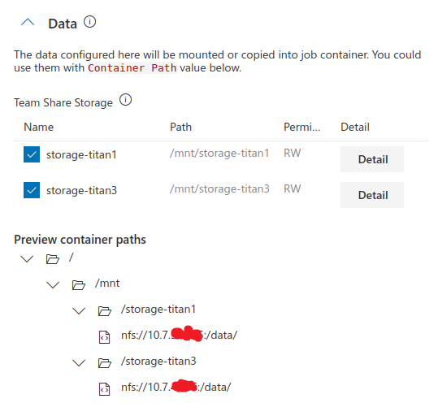
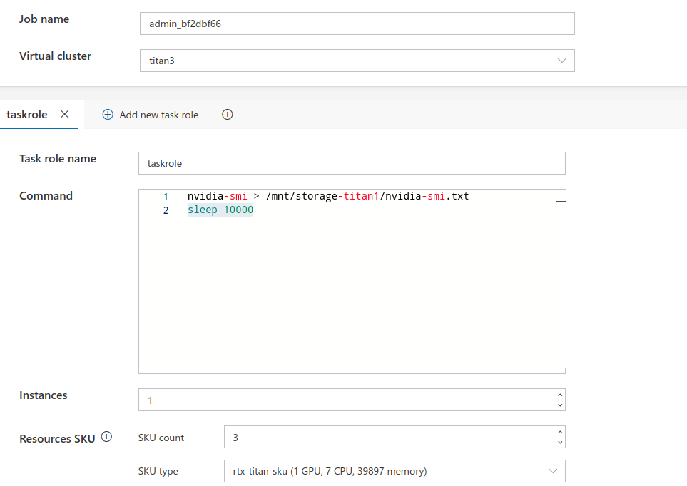
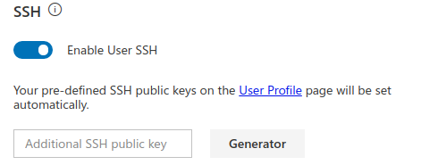
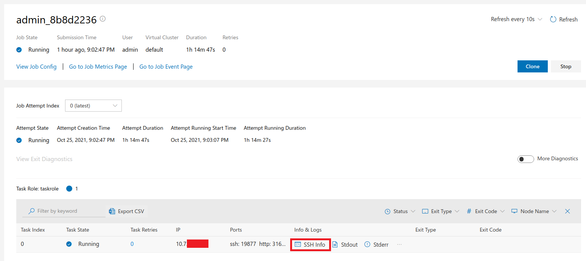
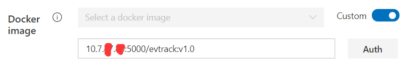

# 用户手册

大部分操作可见于[官方用户手册](https://openpai.readthedocs.io/zh_CN/latest/manual/cluster-user/index.html)

## 挂载存储
为了让Job能够访问硬盘上的数据，OpenPAI提供了存储, [官方提供了教程](https://openpai.readthedocs.io/en/latest/manual/cluster-user/how-to-manage-data.html)
此处进行简单说明


可以通过挂载点(e.g. /mnt/storage-titan1)来访问硬盘上的内容,

```
sudo apt-get install --assume-yes nfs-common  # required by nfs 
sudo mount -t nfs --options nfsvers=4.1 <storage-server-ip>:/data/ /mnt/data
# e.g.
# sudo mount -t nfs --options nfsvers=4.1 10.7.xx.xx:/data/ /mnt/data
```
然后就可以在本地终端`/mnt/data`对文件夹进行操作, 例如通过cp命令将自己的数据拷贝到挂载点进而实现上传

管理员目前将８T硬盘作为实际物理硬盘，用户根据自己需要，
将自己的数据存入**所分配到的虚拟集群**(e.g. titan12)的**实际物理节点**(e.g.10.7.xx.xx)的`/share/data`下，

考虑到`10.7.xx.xx:/data/`是公用的，**建议大家在其中建立自己的文件夹**,
并且定时清理以节约磁盘空间，同时注意做好备份

## 使用SSH
在job command中使用`sleep`，维持docker的运行



将Public Key添加到用户Profile中，



在Job Pannel中，点击`SSH Info`



点击`SSH Info`后可以得到如下信息

```
You can connect to this container by one of the following commands if SSH is set up properly: 

1. Use your default SSH private key:

ssh -p 19877 root@10.7.xx.xx

2. Use a pre-downloaded SSH private key:

On Windows:
ssh -p 19877 -i <your-private-key-file-path> root@10.7.xx.xx

On Unix-like System:
chmod 400 <your-private-key-file-path> && ssh -p 19877 -i <your-private-key-file-path> root@10.7.xx.xx


If you are using a different username in your docker, please change "root" to your pre-defined username.
```

## 加载自定义Docker Image

首先需要在本地修改`daemon.json`
```
{
  "default-runtime": "nvidia",
  "runtimes": {
      "nvidia": {
          "path": "/usr/bin/nvidia-container-runtime",
          "runtimeArgs": []
      }
  },
  "insecure-registries": ["10.7.xx.xx:5000"]  # 增加此行
}
```
然后`sudo systemctl restart docker`使设置生效

```
# rename the docker
sudo docker tag pytorch/pytorch:1.6.0-cuda10.1-cudnn7-devel 10.7.xx.xx:5000/pytorch/pytorch:1.6.0-cuda10.1-cudnn7-devel
sudo docker push 10.7.xx.xx:5000/pytorch/pytorch:1.6.0-cuda10.1-cudnn7-devel
```

可以用下列命令查询，确认镜像已经正确上传
```
curl -X GET http://10.7.xx.xx:5000/v2/_catalog
curl -X GET http://10.7.xx.xx:5000/v2/image_name/tags/list
```
更详细的Docker镜像的之作和上传教程可见于[DOCKER_IMAGE.md](DOCKER_IMAGE.md)

在Job中通过 `10.7.xx.xx:5000/pytorch/pytorch:1.6.0-cuda10.1-cudnn7-devel`，
即可使用`私有docker registry`中的Image



# 总结
整个提交数据，提交代码可以通过nfs，提交镜像通过本地regisry，Job可以打开SSH端口当作一个虚拟机来用，nfs可以挂载到Job虚拟机上；
目测整个工作流不需要用户操作机器，安全性和稳定性有保障